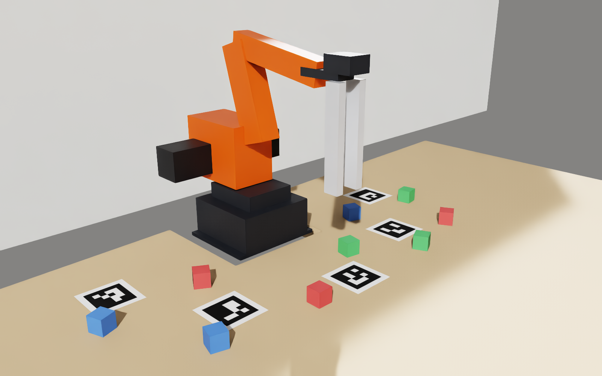
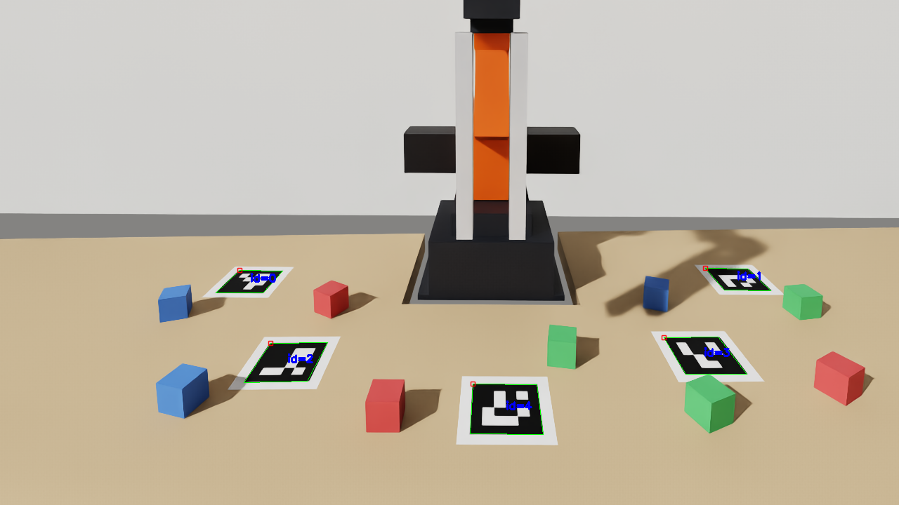

# MT4-sim — the WLKATA MT4 in Isaac Sim

A physics simulation of the [WLKATA MT4](https://www.wlkata.com/) desktop robot
arm, built so that the software written for the real arm runs against it
**unmodified**. Point a task script at the simulator instead of a COM port and it
drives a simulated arm, looks through a simulated camera, and picks up simulated
cubes — without knowing anything changed.



## Why

Testing robot code on real hardware is slow, and a mistake costs you a servo. The
usual answer is a simulator, and the usual problem with a simulator is that it is
a *different* robot: its own coordinate frame, its own units, its own idea of
where the table is. Code that works in the sim then needs porting to the arm,
which is the work you were trying to avoid.

This one is built the other way round. It lives in **the same coordinate frame as
the real arm's control stack**, and its geometry is *read from* that stack rather
than copied into the sim:

- A cube the live rig reports at robot (230, −60) sits at (0.230, −0.060) on the
  stage.
- The arm's joint angles are the same `q1..q4` the firmware speaks, and the
  gripper takes the same firmware `S` value.
- Link lengths, joint limits and the gripper's jaw-span model are imported at
  runtime from the control repo ([enghoff/MT4](https://github.com/enghoff/MT4)),
  so the simulated arm cannot drift from the firmware.
- The desk height, the ArUco tag layout and the camera pose come from the real
  rig's own `vision_calibration.json`. Recalibrate the real rig and the sim is
  one rebuild away from matching it.

The camera is the part that ties it together. Frames rendered from the simulated
scene go straight into the real vision code with nothing adapted, and a tag
detected in a simulated frame — pushed through the live rig's own homography —
comes out where the live rig says that tag is taped to the desk.



*The scene camera's own view, with the live `mt4_vision` ArUco detector's output
drawn on top. This frame was rendered, not photographed.*

## What works

- The URDF chain reproduces the control stack's forward kinematics to **0.0002 mm**
  across the whole soft-limit box.
- The simulated camera's tags decode with `cv2.aruco` and read back through the
  rig's real calibration to **1.6–7.1 mm**; cubes read back to 5.6 mm mean.
- The control repo's `pick`/`place` primitives, its task scripts and its MCP
  tools all run against the sim unmodified, and `stack_cubes.py` builds
  eight-high cube columns with no missed picks.
- The gripper closes on a misaligned cube and **shoves it square** — 20° off
  square comes out 0.1–0.3° off the jaws — instead of jamming on its corners.

Full numbers and how they were measured: [docs/verification.md](docs/verification.md).

## Requirements

- **NVIDIA Isaac Sim** and its Python environment (so an RTX GPU, on Windows or
  Linux). Developed against 6.0.1, using the `isaacsim.*` API namespace.
  Everything below runs through that interpreter.
- **The MT4 control repo**, [enghoff/MT4](https://github.com/enghoff/MT4). It
  supplies the kinematics, the vision stack and the calibration, and it is read
  at import time — the sim will not start without it. It defaults to the sibling
  directory `../MT4`; override with the `MT4_REPO` environment variable.
- Driving the sim with control-repo code also needs that repo's `pyserial` in
  whatever interpreter runs the script.

## Quick start

Build the arm, then the scene, then check it. The first two steps are one-time;
`import_urdf.py` takes about three minutes on a first run.

```powershell
$env:PY = "Z:\IsaacSim\venv\Scripts\python.exe"   # your Isaac Sim python

& $env:PY scripts/build_urdf.py     # kinematics -> assets/mt4.urdf
& $env:PY scripts/import_urdf.py    # -> assets/mt4/mt4.usda
& $env:PY scripts/build_scene.py    # -> assets/mt4_scene.usda
& $env:PY scripts/check.py          # verify against the real stack, render to out/
```

Then watch it move:

```powershell
& $env:PY scripts/run_sim.py            # open the GUI, arm parks and holds
& $env:PY scripts/run_sim.py --demo     # tour the desk: hover every tag and cube
```

The tests need no GPU and no scene:

```powershell
& $env:PY -m unittest discover -s tests
```

## Running your own code against it

`serve_firmware.py` runs the scene and answers the MT4's serial protocol on a
socket. Anything that talks to the arm through `Mt4Client` — which is everything
in the control repo above the serial port — can talk to that socket instead.

```powershell
# terminal 1: be the arm, and the scene camera
& $env:PY scripts/serve_firmware.py --camera

# terminal 2: run a control-repo script, unmodified
& $env:PY scripts/run_against_sim.py --check           # what the client sees
& $env:PY scripts/run_against_sim.py --check-camera    # what the vision stack sees
& $env:PY scripts/run_against_sim.py -- Z:\MT4\jog.py
& $env:PY scripts/run_against_sim.py -- Z:\MT4\stack_cubes.py --marker 2
```

`run_against_sim.py` swaps the one function that opens a COM port for one that
dials the socket, and sets `MT4_CAMERA_URL` so the vision code opens the
simulated camera feed. The script itself is unchanged, and neither it nor
`Mt4Client` can tell. If you would rather patch nothing at all, serve on one half
of a virtual null-modem pair with `--listen COM21` and connect the normal way.

The scene stocks nine 20 mm cubes — three red, three green, three blue — which is
what a full nine-level `stack_cubes` run needs. Markers 0–3 work as stack sites;
marker 4 sits under the arm's camera-park pose and the control repo refuses it.

`demo_pick_place.py` is the smallest interesting thing to run in that second
terminal: it moves one cube using the control repo's own `pickplace.pick` and
`place`, so if it works, the firmware substitute is good enough for the real
stack.

```powershell
& $env:PY scripts/demo_pick_place.py              # a red cube, 60 mm further out
& $env:PY scripts/demo_pick_place.py --color blue --to X Y
```

Two checks bring their own scene and server, so they run on their own:

```powershell
& $env:PY scripts/check_firmware.py           # did a real pick actually move a real cube?
& $env:PY scripts/check_grip.py --yaw-error   # can the jaws square a crooked cube?
```

## Documentation

The design notes live in [docs/](docs/). Each one is a standalone account of a
part of the model and why its constants are what they are.

| | |
|---|---|
| [verification.md](docs/verification.md) | what is checked, against what, and the numbers |
| [kinematics.md](docs/kinematics.md) | the MT4's parallel linkage expressed as a serial URDF chain |
| [frames.md](docs/frames.md) | what z = 0 is, where the desk sits, and why `table_z` is not the table |
| [cad-audit.md](docs/cad-audit.md) | the firmware's constants recovered independently from WLKATA's CAD |
| [scene.md](docs/scene.md) | the desk, tags, cubes and lighting — and two physics settings that mislead |
| [gripper.md](docs/gripper.md) | the jaw servo, the grip force, and the coordinate the real gripper does not have |
| [camera.md](docs/camera.md) | fitting the simulated lens to the rig's homography, and serving its frames |
| [firmware.md](docs/firmware.md) | the serial protocol substitute: what is faithful, what is a stand-in |
| [gripper-fires-open.md](docs/gripper-fires-open.md) | an investigation, kept as a worked example |

## Layout

| Path | What |
|---|---|
| `mt4_sim/chain.py` | model angles ↔ URDF joints, limits, gripper span / stall, `DESK_Z_MM` |
| `mt4_sim/urdf.py` | the URDF: link shapes, masses, joint table |
| `mt4_sim/calibration.py` | reads `vision_calibration.json` as scene geometry: table, tags, camera |
| `mt4_sim/rig.py` | desk extent, colours, cubes — the layout the calibration has no opinion on |
| `mt4_sim/scene.py` | builds the stage |
| `mt4_sim/arm.py` | `SimArm`: drive by model angles, force-capped jaws, read TCP, solve the repo's IK |
| `mt4_sim/camera_feed.py` | shared-memory publisher/reader for `/World/SceneCamera` frames |
| `mt4_sim/sim_capture.py` | duck-typed `VideoCapture` / `FrameStream` over that feed |
| `mt4_sim/markers.py` | renders the ArUco tag textures |
| `mt4_sim/mt4_repo.py` | finds the control repo and puts it on `sys.path` |
| `mt4_sim/firmware/` | the firmware's serial personality: `state`, `planner`, `machine`, `link` |
| `scripts/` | `build_urdf` → `import_urdf` → `build_scene` → `check` / `run_sim` |
| `scripts/serve_firmware.py` | the scene, answering the MT4 protocol on a socket (`--camera` publishes frames) |
| `scripts/run_against_sim.py` | runs any control-repo script against that socket (and camera feed) |
| `tests/` | chain maths, the serial protocol, and the camera feed — all without a GPU |
| `tools/step_assembly.py` | STEP assembly parser and bore-based kinematic audit |
| `tools/spread_cubes.py` | picks a cube layout everything on the rig can actually reach and see |
| `vendor/MT4-STL/` | WLKATA's official STL + STEP CAD (upstream clone) |
| `assets/`, `out/` | generated USD and renders (not tracked) |

## Limitations

**No envelope guard below the firmware layer.** `SimArm.set_model_angles` checks
the soft joint limits and nothing else. The ground-Z floor and keep-out cylinder
are enforced by `mt4_sim/firmware` on the `mp`/`mq` path, as on the real arm, but
a caller poking `SimArm` directly bypasses them; the desk is a collider, so the
arm stops on it rather than being refused.

**Nominal masses.** The arm is position-driven, so link masses set how hard the
solver works, not where the TCP ends up. They are estimates, not measurements.

**The arm renders as boxes.** They are sized from WLKATA's CAD and are
dimensionally right, but the real meshes are not wired up yet — see
[cad-audit.md](docs/cad-audit.md).

**Some things are deliberately a stand-in**, and say so: homing does not seek for
limit switches, moves have no acceleration ramp, and floating the motor drivers
does not make the arm go limp. [firmware.md](docs/firmware.md) lists them.
